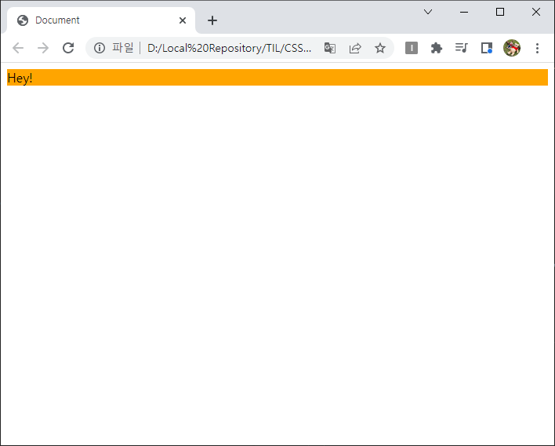
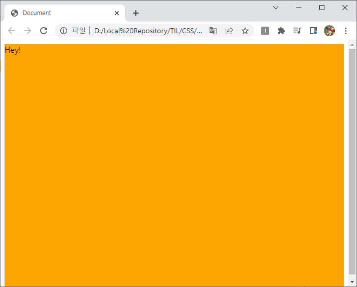
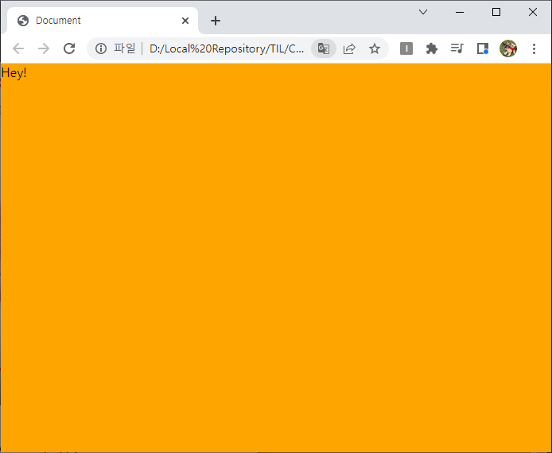

# CSS 단위 - %, vw/vh, vmin/vmax, em/rem
> 목차
> 1. [% (퍼센트)](#1--퍼센트)
> 2. [vw / vh](#2-vw--vh)
> 3. [vmin / vmax](#3-vmin--vmax)
> 4. [em / rem](#4-em--rem)

반응형 웹을 만들 때는 고정적인 px보다는 유동적인 %를 사용하는 것이 좋다. 그 밖에 뷰포트를 기준으로 하는 `vw/vh`, `vmin/vmax`와 폰트를 기준으로 하는 `em/rem` 단위가 있다.

## 1. % (퍼센트)
%는 부모 요소를 기준으로 하는 상대적인 단위이다. 부모 div가 600px이고, 자식 div가 60px이라고 하자. 이 둘을 반응형으로 만들기 위해 %단위로 바꾸려면 부모 div는 100%, 자식 div는 10%로 설정하면 된다.

하지만 주의할 점이 있다. 부모의 크기를 기반으로 %를 계산하기 때문에 상위 요소에 크기가 지정되어 있지 않다면 예상했던 것과 달리 크기 적용이 되지 않는다는 것이다.

예를 들어 화면에 꽉 차는 div를 만들고 싶다고 하자.  
그러면 그냥 그 div에 width: 100% 설정을 하면 되는 거 아니냐고 생각할 수 있다.

```HTML
<html>
  <body>
    <div class="div1">
      Hey!
    </div>
  </body>
</html>
```

```CSS
.div1 {
  width: 100%;
  background-color: orange;
}
```



div의 부모 요소인 html과 body에 크기가 지정되어 있지 않으므로 div도 % 계산을 할 수 없는 것이다.  
따라서 모든 부모 요소(html, body)에도 다음과 같이 크기 지정을 해주면 계산이 정상적으로 된다. 

```CSS
html, body {
  height: 100%;
  /* margin: 0; */
}

.div1 {
  width: 100%;
  background-color: orange;
}
```



스크롤이 생기고 바깥에 흰 여백이 있는 것은 body에 기본적으로 margin이 들어가있기 때문이다. 따라서 body에 margin: 0; 설정을 해주면 된다. 화면을 늘리거나 줄여도 그에 맞게 사이즈가 조절된다.



## 2. vw / vh
viewport weight, viewport height의 약자이다.  
뷰포트를 기준으로 하는 단위이다. 따라서 %를 사용할 때 상속을 신경써야 하는 것과 달리, 보여지는 화면(뷰포트)를 기준으로 하기 때문에 직관적으로 디자인할 수 있다는 장점이 있다.

화면 전체를 꽉 채우는 게 100vw, 100vh이고, 1vw, 1vh는 뷰포트의 1%와 같다.  
꼭 너비나 높이갚에만 쓸 수 있는 건 아니고 폰트 사이즈에도 적용할 수 있다. (예-`font-size: 10vw`, 뷰포트가 넓어질수록 폰트 사이즈도 커진다)

### 예제
만약 높이가 600px인 디바이스에서 높이가 50px인 헤더의 나머지 부분의 크기를 설정하고 싶다면
- % 방식:  
  body, html에 height: 100%을 지정한 뒤, (50px / 600px) * 100 처럼 일일이 %를 구해 지정해야 했을 것이다.
- vh를 이용한다면:  
  `height: calc(100vh - 50px)`처럼 간단하게 높이를 지정할 수 있다.

## 3. vmin / vmax
v가 붙은 것에서 알 수 있듯이 이것도 뷰포트를 기준으로 하는 단위이다. 다만 vmin은 vw와 vh중 더 작은 것을 적용하고, vmax는 더 큰 것을 적용한다.

이게 무슨 말이냐면
1200px * 600px인 뷰포트가 있을 때, 1vmax는 더 큰 쪽인 가로를 선택해 1vw(12px)와 같아지고, 1vmin은 더 짧은 쪽인 세로를 선택해 1vh(6px)와 같아진다는 뜻이다.

### `vmin`과 `vmax`는 어떨 때 유용할까?
- vmin: '언제나 화면에 보여야 하는 요소'를 만들 때 유용하다.
- vmax: 이미지를 빈틈없이 화면에 꽉 차게 할 때 유용하다.

### 예제
1. 화면의 정중앙에 80% * 80%인 정사각형을 표시하고 싶다고 해보자. 중앙 정렬은 flex를 이용한다. 현재 뷰포트는 1000px * 1000px이다.

2. 브라우저 창의 높이를 줄여도 정사각형을 유지해야 하기 때문에 `width: 80vw; height: 80vh;`처럼 설정하면 안된다. 브라우저 창의 너비만 줄이면 높이는 그대로이고, 높이만 줄이면 너비는 그대로라 직사각형이 될 것이다. 따라서 `width: 80vw; height: 80vw;`와 같이 너비를 기준으로 만들기로 한다. (이때 정사각형은 800px * 800px)

3. 그런데 브라우저 창의 높이가 어느 정도 줄어들었을 때 문제가 발생한다. 1000px * 500px로 뷰포트의 높이가 줄어들었다고 하자.  
height의 단위를 vw로 했기 때문에 1000px의 80%인 800px보다 창의 높이가 줄어들 때부터 정사각형의 하단이 잘리기 시작한다. 그래서 의도와는 달리 중앙에 위치하는 것이 아니라 요소가 잘려서 스크롤로 내려서 봐야하는 상황이 되었다. (여전히 800px * 800px. 그래서 요소가 잘려보임)

4. 이럴 때 필요한 게 **vmin**이다. `width: 80vmin; height: 80vmin; `처럼 설정하면 만약 브라우저가 1000px * 500px이 됐을 때 가로/세로 중 더 크기가 작은 쪽을 기준으로 80%를 계산하게 된다. 500px의 80%는 400px이므로 정사각형은 400px * 400px이 된다. 항상 작은 쪽에 맞추기 때문에 잘릴 염려가 없다.

> vmax를 지원하지 않는 브라우저(예-Edge)가 있으므로 참고

## 4. em / rem
### em
부모의 폰트 크기를 기준으로 하는 단위이다.  
> 부모의 폰트 크기 = 1em

대부분 브라우저에서 스타일을 지정해주지 않았을 때 폰트 크기의 기본값은 16px이므로 1em = 16px, 2em = 32px이 된다.
만약 부모의 폰트 크기가 20px이면 1em = 20px, 1.5em = 30px이 된다. 부모의 폰트 크기를 변경하면 자식도 덩달아 변하게 할 수 있다.

### rem
rem은 root를 기준으로 하는 em이란 뜻이다. em은 부모 요소를 기준으로 하지만 rem은 root 엘리먼트, 즉 html에 지정된 폰트 사이즈를 기준으로 계산한다.
> root 요소(=html)에 지정된 폰트 크기 = 1rem

```CSS
html { font-size: 20px; }
.parent { font-size: 1rem; } /* 20px */
.child { font-size: 0.8rem; } /* 16px */
```

### em / rem 활용법

다음과 같이 content \<div>안에 이미지, 텍스트, 더 작은 텍스트가 있다. 그리고 페이지 내에 content의 폰트 사이즈를 조절할 수 있는 옵션이 있다고 하자.

```HTML
<div class="content">
  
  <div class="content__text">
    This is an orange.
  </div>
  <div class="content__text--small">
    very tasty and sweet
  </div>
</div>
```

```CSS
.content {
  font-size: 20px;
}
.content__image {
  width: 10em;
}
.content__text {
  font-size: 1.5em;
  margin-top: 0.5em;
}
.content__text--small {
  font-size: 0.5em;
}
```

content의 폰트 사이즈가 현재는 20px이지만, content의 폰트 사이즈를 늘이거나 줄이면 그에 맞춰 이미지, 텍스트의 크기, 이미지와 텍스트 사이의 마진이 모두 그에 맞춰 늘어나거나 줄어들 것이다.

이것을 이용해서, 반응형을 쉽게 만들 수 있다. 미디어 쿼리에서 모든 요소에 일일이 신경쓸 필요 없이 부모의 폰트 사이즈만 변경해주면 된다.
```CSS
.content {
  font-size: 40px;
}
.content__image {
  width: 10em;
}
.content__text {
  font-size: 1.5em;
  margin-top: 0.5em;
}

@media all and (max-width: 750px) {
  .content {
    font-size: 20px;
  }
}
```

하지만 em은 부모 요소가 뭔지 신경써야 하고, 그에 맞춰 px을 em으로 일일이 계산해야 한다는 불편함이 있다.  
그럴 때 rem을 사용하면 html의 폰트 사이즈만 신경쓰면 되기 때문에 더 간편하다.

```CSS
html {
  font-size: 62.5%; /* 10px. 보통 기본값이 16px이므로 10/16*100으로 퍼센트 계산한 값 */
}
.content__image {
  width: 12rem; /* 10px * 12 */
}
.content__text {
  font-size: 1.6rem; /* 16px */
  margin-top: 5rem; /* 50px */
}

@media all and (max-width: 750px) {
  html {
    font-size: 50%;
  }
}
```

html을 10px이 아니라 62.5%로 한 이유는 사용자가 웹 브라우저 설정에서 기본 폰트 크기를 변경할 수 있기 때문이다. 접근성을 고려하기 위해 고정 단위인 px이 아니라 %로 계산한 것이다.
```CSS
html { font-size: 62.5%; }
```

> em과 rem 중 rem을 쓰는 것을 더 권장! em은 신경쓸 게 너무 많다...  
> (rem은 IE9부터 지원)