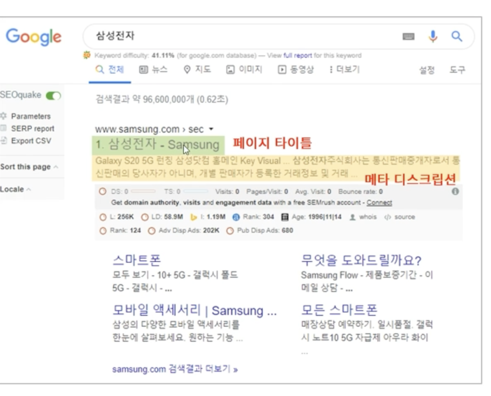
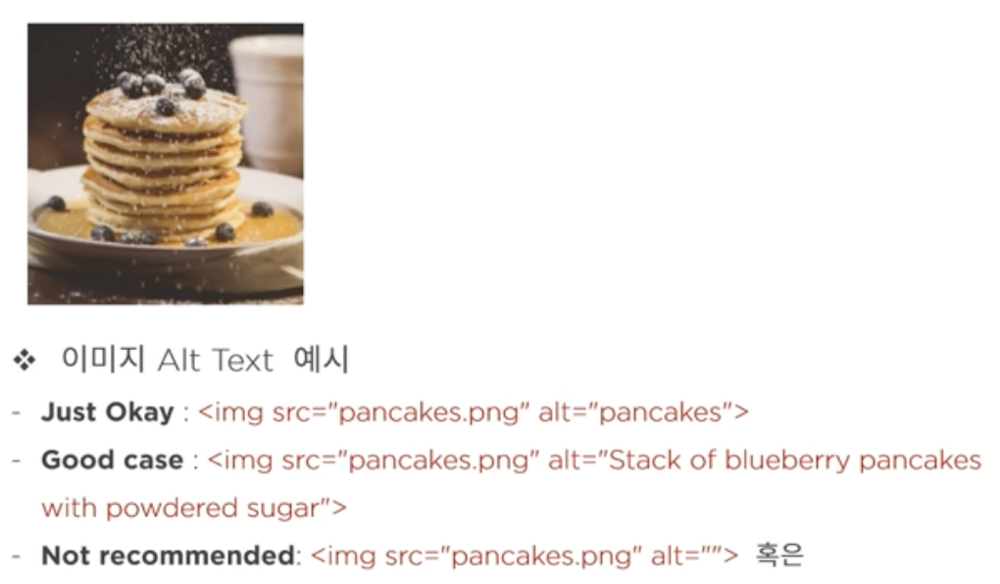

# 사이트 SEO 높이기

## SEO 중요성

<br>

**SEO란 검색엔진이 사이트의 모든 컨텐츠를 읽을 수 있도록 사이트 구조를 개선하는 작업이다.**

<br>

기존 전통적인 방식으로는 TV, 광고를 통해 브랜드를 각인 시키는 형태로 마케팅을 진행해왔다.

하지만 최근에는 **소비자가 직접 검색하는 환경으로 변환**이 되었다.

<br>

구글, 네이버 같은 검색 검색엔진에서 자연적 검색, 유료 광고로 인한 정보들이 나온다.

이때 대다수의 유저들은 자연적 검색에 70~80프로 정도 유료 광고보다 더 페이지를 들어간다고 한다.

<br>

따라서 SEO를 향상시켜 자연적 검색의 최상단 부분에 위치시키는 것이 더 중요해 졌다.

<br>

대부분 유저들은 첫페이지에서 98%가 머문다고 한다.

따라서 SEO를 향상 시키는게 훨씬 중요해졌다.

<br>

SEO 상승후 기대효과

1. 사이트 인지도
2. 신뢰도
3. 방문자 상승
4. 비지니스 기회 창출

<br>

## 페이지 타이틀



- 페이지 타이틀의 권장사항은 70글자 이내이다.
- **최우선 키워드로 페이지 타이틀을 구성하고** ' - ' 을 이용하여 세컨더리 키워드를 추가하는 방법도 좋다.
- 국영문 형태로 구조화 하여 SEO을 만드는 방법도 좋다. ex) 삼성전자 - Samsung

<br>

## 메타 디스크립션

- 권장사항은 144글자 이내이다.
- 해당 페이지에 대한 설명을 핵심 키워드로 설명하는것이 좋다. 또한 **세컨더리 키워드, 써드 키워드를 통해서 설명하는** 것이 좋다.
- ' **왜 ' 이 페이지를 클릭해야하는지**, 어떤 정보를 제공하는지에 대해 최대한 기술하는 것이 좋다.

<br>

## 헤딩 태그

- 글자수는 실제로 길지 않아도 된다.
- 핵심 주제를 기준으로 설정한다.
- 검색로봇과 사람이 실제로 볼 수 있는 컨텐츠이다. 따라서 헤딩태그는 SEO 관점에서 굉장히 중요하다.
- 해당페이지를 포괄하는 대주제는 H1으로 지정하고 해당 페이지 에서 1개만 있어야한다. 그 아래로 내려갈 수록 H2-H6 여러개 가능하다.
- 검색엔진은 주로 페이지에서 Heading 키워드를 우선순위로 파악하여 페이지에 문맥 구조를 파악하고 그외에 나머지 텍스트를 읽는 경향이 있다.
- 이미지는 H1에 지정하지 않는다.

<br>

## meta keyword

HTML의 메타태그의 keyword 부분에 해당 페이지에 대해 키워드를 적어 놓는다.

<br>

위에서 있는 title, description, keyword 3가지는 세트로 생각한다.

각각 페이지 별로 고유한 제목, 설명, 키워드를 설정해야한다.

<br>

## 스트럭처 데이터 마크업

구글 검색결과에 스니펫으로 최상단 또는 우측에 보여질 수 있다.

- 스니펫은 페이지 콘텐츠를 바탕으로 자동 생성된다.
- 스니펫은 사용자의 구체적인 검색어와 관련성이 가장 높은 페이지 콘텐츠를 강조하고 이에 관한 미리보기를 제공하도록 만들어졌다.
- 따라서 같은 페이지라도 검색어에 따라 표시되는 스니펫이 달라질 수 있다.
- [구글 스니펫](https://developers.google.com/search/docs/advanced/appearance/good-titles-snippets?hl=ko)

<br>

스트럭처 데이터 마크업 종류

1. BreadCrumb
2. 기사
3. FAQ
4. 조직정보
5. How to
6. Logo
7. 제품
8. Q&A
9. 리뷰

<br>

```jsx
<script type="application/ld+json">
    {
      "@context": "https://schema.org/",
      "@type": "Recipe",
      "name": "Party Coffee Cake",
      "author": {
        "@type": "Person",
        "name": "Mary Stone"
      },
      "datePublished": "2018-03-10",
      "description": "This coffee cake is awesome and perfect for parties.",
      "prepTime": "PT20M"
    }

https://developers.google.com/search/docs/advanced/structured-data/intro-structured-data?hl=ko
```

## 컨텐츠

- 최근 구글은 컨텐츠와 각 키워드의 연관성을 분석해서 만듬으로 전략적으로 컨텐츠를 만들어야한다.

<br>

## URL

- 유저가 기억하기 쉬운 URL이 필요하다.
- 각각 Path가 카테고리 별로 쉽게 네이밍을해 만드는 것이 좋다.

<br>

## 이미지 Alt text



- 이미지 링크는 절대경로를 사용해야 검색엔진이 잘 인지한다.
- HTML 코드를 통해 이미지의 기능과 모습을 필요 키워드와 함께 설명한다.
- 검색엔진이 해당 이미지의 키워드와 웹사이트를 이미지 검색등을 통해 매칭시켜준다.
- alt 텍스트 내용은 간단하게 적는것도 나쁘지 않은 방법이다. 하지만 더 자세히 해당 이미지에 대해 적어준다면 굉장히 좋은 점수를 준다.
- 반대로 아예 빈문자열을 넣어주거나 너무 많은 키워드를 넣어준다면 검색엔진이 신뢰도 점수를 하락시켜주어 좋지 않다.

<br>

## robots.txt

- 크롤링 해야하는 웹사이트 정보에 관한 룰을 등록한다.
- 사이트의 페이지들에 대한 사이트 맵을 제공한다.
- 검색엔진에 보여져야할 정보, 아닐 정보들을 이곳에 올린다.

<br>

참고

- 패스트캠퍼스 검색 최적화(SEO) 운영 / 전략 올인원 패키지 강의
- [https://developers.google.com/search/docs/advanced/appearance/good-titles-snippets?hl=ko](https://developers.google.com/search/docs/advanced/appearance/good-titles-snippets?hl=ko)
- [https://developers.google.com/search/docs/advanced/structured-data/intro-structured-data?hl=ko](https://developers.google.com/search/docs/advanced/structured-data/intro-structured-data?hl=ko)