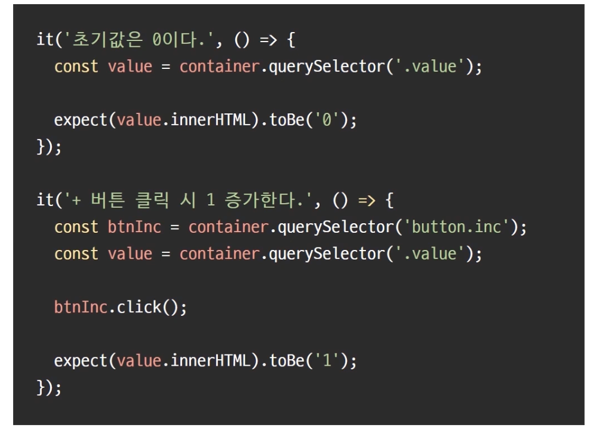
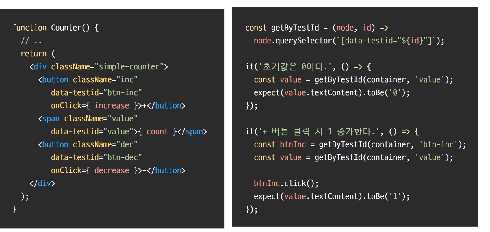
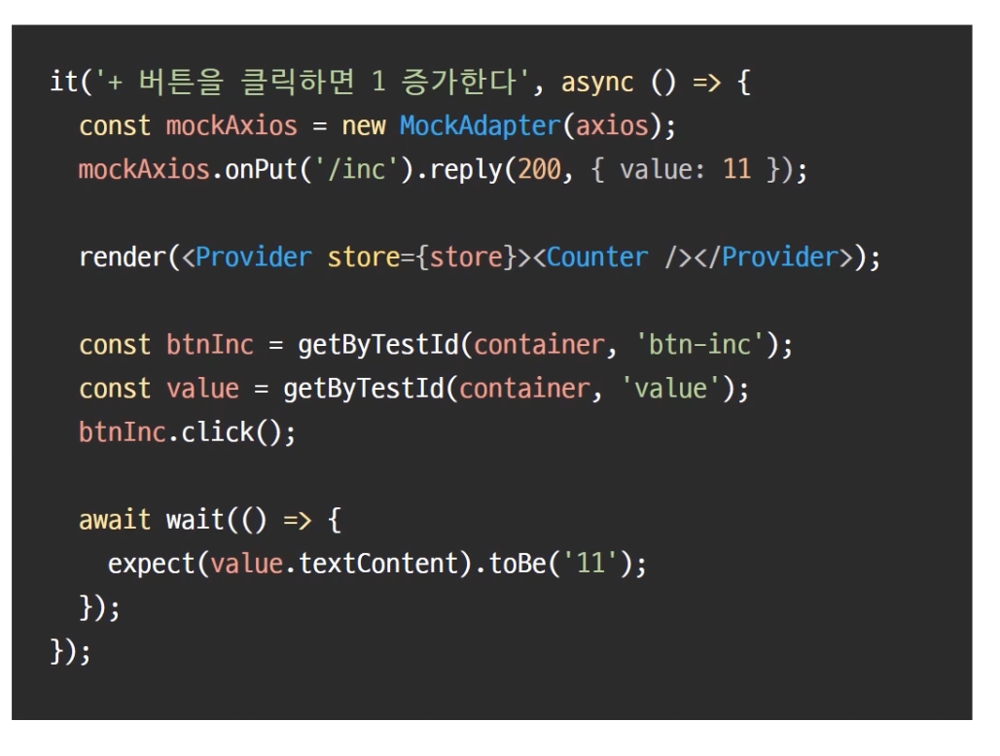
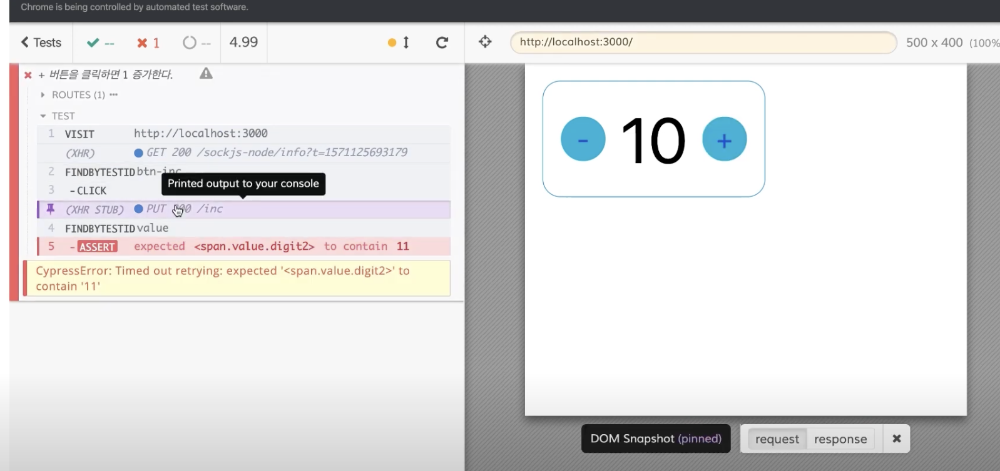

- [프론트엔드 TDD](#프론트엔드-tdd)
  - [시각적 테스트](#시각적-테스트)
    - [UI 상태별 시각적 테스트](#ui-상태별-시각적-테스트)
  - [기능적 테스트](#기능적-테스트)
    - [잘못된 DOM 탐색](#잘못된-dom-탐색)
    - [올바른 DOM 탐색](#올바른-dom-탐색)
  - [단위 테스트(Unit Test)](#단위-테스트unit-test)
  - [통합 테스트](#통합-테스트)
    - [**통합 테스트 도구 (강추 Cypress)**](#통합-테스트-도구-강추-cypress)
  - [정리](#정리)
    - [**시각적 테스트 vs 기능적 테스트**](#시각적-테스트-vs-기능적-테스트)
    - [단위 테스트 vs 통합 테스트](#단위-테스트-vs-통합-테스트)

# 프론트엔드 TDD

 

- 시각적 테스트, 기능적 테스트가 무엇인지?
- 시각적, 기능적 테스트를 분리해야하는 이유?
- 시각적 테스트를 어떻게 할까?
  - 시각적 회귀 테스트
  - UI 상태별 시각적 테스트
- 기능적 테스트를 어떻게 할까?
- 단위 테스트, 통합테스트는 무엇인지?
- 단위 테스트의 장단점
- 통합 테스트의 장단점
- 정리

 

## 시각적 테스트

 

### UI 상태별 시각적 테스트

**상태별 UI가 변화되는것을 테스트 하기위해서 각각 다른 상태를 넣어 컴포넌트를 비교해야함**

 

이런 테스트를 할때 **StoryBook**이 굉장히 유용함

- **내가 원하는 케이스를 미리 등록해둔뒤**, 빠르게 해당 컴포넌트만 보고 테스트를 할 수 있음
- 테스트 도구는 아니지만, 각 **상태별 UI를 등록해놨기 때문에 시각적 테스트에 용이함**
- **디자이너와 커뮤니케이션을 할때, StoryBook을 사용**해서, 상태별, 페이지별 컴포넌트를 공유하기 용이함

 

## 기능적 테스트

TDD 가능

with Jest, Mocha...

 

기능적 테스트?

- **기능적으로 결과값이 잘나오는지 테스트**
- **기능적으로 잘 동작하는지**
  

 

### 잘못된 DOM 탐색

**시각적 테스트를 분리해야함**

→ DOM 탐색을 할때, 클래스 이름이 **시각적 표현을 위한 클래스 명을 사용하면 안됨,**

→ **시각적인 요소를 변경하기 위해 수정했을때, 테스트 코드도 오류가 생김**

 

### 올바른 DOM 탐색

→ **기능만을 위한 의미있는 클래스명을 사용해야함**

→ 테스트를 위한 별도의 속성값 사용

→ `getByTestID`를 사용해야함

 

시각적 요소와 상관없이 **테스트 요소를 항상 변함없이 선택가능함**

 

## 단위 테스트(Unit Test)

**작은 기능별로 테스트**를 하는 것을 단위 테스트라고함.

 

단점

- 테스트는 비용이다. 테스트 코드는 작성 및 유지보수, **자원 비용이 많이든다.**
- **복잡한 로직이 없는 단위는 불필요하다.** 차라리 복잡한 로직이 있는 경우 단위 테스트가 유용하다.

 

단위를 어떻게 보냐에 따라 테스트 단위가 달라짐.

- 연관된 기능별로 테스트 하는 것,
- 각각 기능별로 테스트 하는 것

 

## 통합 테스트

**컴포넌트 기반의 테스트중 가장 좋은 것은 통합 테스트**라고 할 수 있다.

**컴포넌트 단위별로 테스트를 실행함**

 

 

**전체적인 컴포넌트의 기능의 과정을 통합해서 테스트 함**

 

장점

- **여러가지 기능들을 통합해서 테스트 가능함**
- 단위테스트의 단점이였던 **기능과 기능 사이의 연결되는 부분에 대한 테스트를 못하는 부분까지 다 커버해서 테스트 가능함**

 

### **통합 테스트 도구 (강추 Cypress)**

Jest vs **Cypress**

 

개발도구로 사용하기 좋음

- **브라우저 내부에서 실행가능**
- 브라우저 디버깅 도구, 익스텐션를 사용할 수 있음
- **UI 개발 환경을 더 직관적**으로 볼 수 있음( 커맨드 라인 환경보다)

 

 

## 정리

### **시각적 테스트 vs 기능적 테스트**

둘 사이의 구분이 명확하지 않은 경우가 많음

**더 적은 비용과 더 많은 결과가 오는것을 선택하면 됨**

 

### 단위 테스트 vs 통합 테스트

각 장단점이 있음

**복잡한 로직인경우 단위 테스트**

**애플리케이션 단위는 통합 테스트**

 

**6줄 요약**

1. 테스트 코드가 **신뢰를 주는지 항상 의심**
2. 테스트는 비용, **불필요한 테스트 최소화**
3. **시각적 테스트와 기능적 테스트 분리!**
4. 모듈 단위 테스트 보다 **컴포넌트 단위 통합 테스트를 먼저 생각**
5. **Storybook**을 사용하면 **시각적 요소**를 편리하게 테스트
6. **Cypress**를 사용하면 **기능적 요소**를 편리하게 테스트

 

참고

- [https://www.youtube.com/watch?v=q9d631Nl0_4&t=49s](https://www.youtube.com/watch?v=q9d631Nl0_4&t=49s)
- [https://www.youtube.com/watch?v=L1dtkLeIz-M&t=353s](https://www.youtube.com/watch?v=L1dtkLeIz-M&t=353s)
- [https://www.youtube.com/watch?v=Npi21gLIEZM](https://www.youtube.com/watch?v=Npi21gLIEZM)